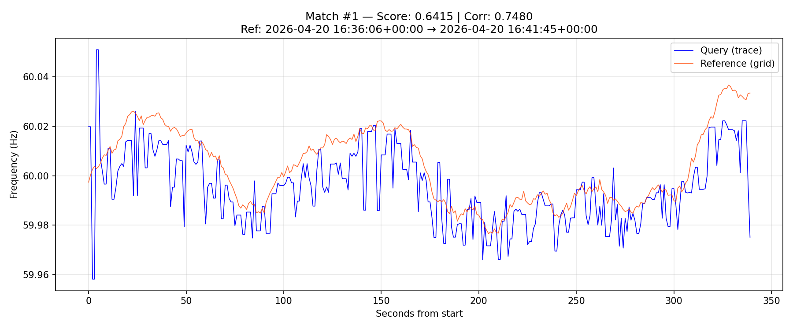
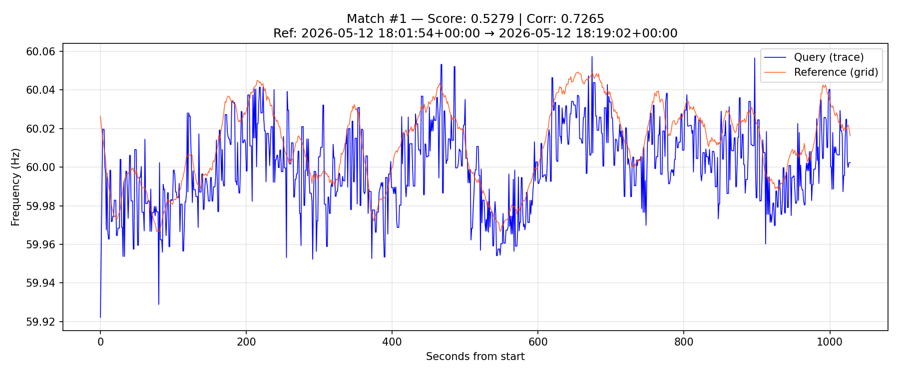

# enf
Electric Network Frequency Analysis tool

## Overview

This repository contains a local Electric Network Frequency (ENF) analysis tool that extracts ENF signatures from audio and video recordings, then compares them against known grid-frequency reference data from one of four North American grids:

- **EI** (Eastern Interconnection)
- **WECC** (Western Electricity Coordinating Council)
- **ERCOT** (Electric Reliability Council of Texas)
- **Quebec**

The tool is research-oriented and designed as an investigative aid to narrow down plausible time windows for human review, not as a standalone proof system.

## Quick Start

### Setup
```bash
# Create and activate virtual environment
python -m venv .venv
.\.venv\Scripts\activate          # Windows
source .venv/bin/activate         # Linux/macOS

# Install dependencies
pip install -r requirements.txt
```

### Basic Workflow

**1. Extract ENF from audio/video:**
```bash
python enf_extract.py --input recording.wav --output trace.csv
python enf_extract.py --input recording.mp4 --output trace.csv  # requires ffmpeg on PATH
python enf_extract.py --input recording.wav --output trace.csv --export-figure
python enf_extract.py --input recording.wav --output trace.csv --figure-output trace_overview.png
```

**2. Compare against grid reference data:**
```bash
python enf_compare.py \
  --trace trace.csv \
  --grid-dir source_data/grid_data \
  --region EI \
  --date 2026-04-20 \
  --top-n 5 \
  --plot
```

**3. Inspect matches in GUI:**
```bash
python enf_view.py --results results.json
```

**4. Benchmark extraction techniques across built-in cases:**
```bash
python enf_benchmark.py --output-dir benchmark_runs/default-suite
python enf_benchmark.py --techniques baseline,dp-multitaper-snr-multi --cases fan-iphone-apr20,microwave-apr20
```

Most built-in benchmark cases are tracked `.m4a` recordings, so a full default run needs `ffmpeg` on `PATH` just like other non-WAV/non-FLAC extraction inputs. In a normal checkout without `ffmpeg`, the harness still runs any directly supported cases and records per-case extraction failures in the summary instead of aborting the whole benchmark.

## Tools

### `enf_extract.py` — ENF Extraction from Audio/Video

Extracts Electric Network Frequency using Quadratically Interpolated FFT (QIFFT).

**Usage:**
```bash
python enf_extract.py --input FILE [--output OUTPUT.csv] [options]
```

Reads WAV and FLAC directly. Other audio formats and video inputs are converted to a temporary mono 48 kHz WAV with `ffmpeg`, so `ffmpeg` must be installed and available on `PATH` for those cases.

**Key Arguments:**
- `--input` (required): Audio or video file
- `--output`: Output CSV path (default: `{input_stem}_enf.csv`)
- `--nominal`: Expected fundamental grid frequency in Hz (default: 60). This sets the center of the extraction search. Change it for 50 Hz systems or when you know the source is not standard North American mains.
- `--harmonic`: Which harmonic to extract (default: 2 — second harmonic at 120 Hz)
  - Harmonic 2 is recommended — much cleaner results with less noise contamination
  - Result is automatically divided back to fundamental (60 Hz)
- `--bandwidth`: Half-bandwidth in Hz around the target harmonic for both the bandpass filter and FFT peak search (default: 0.5). Narrow it to reject nearby tones; widen it when the ENF drifts more or the nominal is less certain.
- `--frame-sec`: Duration of each FFT analysis frame in seconds (default: 1.0). Longer frames usually give steadier frequency estimates but blur faster changes. Shorter frames react faster but are noisier.
- `--overlap`: Fraction of each frame reused by the next frame, from 0 to 1 (default: 0.5). Higher overlap produces more intermediate estimates that are later averaged into the roughly 1 Hz output trace.
- `--pad-factor`: Zero-padding multiplier before the FFT (default: 16). This improves bin spacing for QIFFT interpolation but mainly trades runtime for smoother peak placement.
- `--tracking-mode`: Frame-to-frame ridge selection mode: `peak` for the original frame-independent maximum or `dp` for dynamic-programming ridge tracking with a continuity penalty (default: `peak`).
- `--spectrum-estimator`: Spectrum builder for each frame: `fft` for the original single-window spectrum or `multitaper` for DPSS multi-taper averaging in weaker/noisier recordings (default: `fft`).
- `--median-window`: Median filter width applied after aggregation (default: 3, `0` to disable). Use it to suppress isolated spikes without smearing the whole trace the way a moving average can.
- `--multi-harmonic`: Experimental mode that extracts multiple harmonics and fuses them into one 60 Hz trace.
- `--harmonics`: Comma-separated harmonic list for experimental fusion (default: `1,2,3`). Requires `--multi-harmonic`.
- `--harmonic-fusion`: Experimental fusion method: `weighted`, `vote`, `mean`, or `snr-weighted` (default: `weighted`). Requires `--multi-harmonic`.
- `--confidence-output`: Append `confidence_score` to the output CSV. In both single- and multi-harmonic mode this is normalized to the 0-1 range, where larger values indicate a stronger or more self-consistent estimate.
- `--detail-output`: Write per-harmonic CSVs like `trace_h1.csv` next to the main output. Requires `--multi-harmonic`.
- `--export-figure`: Save a two-panel PNG with a 0-250 Hz spectrogram and the final extracted ENF trace
- `--figure-output`: Explicit path for the PNG figure; when provided, figure export is enabled automatically

**Experimental multi-harmonic mode:**

- The default experimental set is harmonics 1, 2, and 3.
- Each harmonic is extracted with the existing single-harmonic pipeline, smoothed individually, then fused into one trace.
- `weighted` favors harmonic 2, then 3, then 1.
- `vote` returns one of the actual harmonic estimates rather than inventing a midpoint when two harmonics disagree.
- `snr-weighted` uses measured local harmonic quality instead of a fixed harmonic priority.
- On low-sample-rate audio, unsupported default harmonics are skipped with a warning. If you explicitly request an unsupported harmonic, extraction fails cleanly instead of crashing.

**Practical tuning guide:**

| Goal | What to change |
| --- | --- |
| Cleaner trace from a steady recording | Increase `--frame-sec`, keep moderate/high `--overlap`, and use a small `--median-window` such as 3 or 5 |
| Track faster variation or avoid over-smoothing | Decrease `--frame-sec`, keep `--median-window` small, or set `--median-window 0` |
| Tolerate larger drift or uncertain nominal frequency | Increase `--bandwidth` slightly |
| Reduce random one-sample spikes | Increase `--median-window` modestly |
| Improve peak interpolation without changing the basic time resolution | Increase `--pad-factor`, keeping in mind the runtime cost |
| Prefer a globally smoother, continuity-aware track | Switch to `--tracking-mode dp` |
| Reduce variance on weak but still narrowband ENF | Switch to `--spectrum-estimator multitaper` |
| Try the experimental fused extractor on weak/noisy samples | Add `--multi-harmonic`, and compare `weighted` vs `vote` |

**Output CSV columns:**
- `offset_seconds`: Seconds from start of recording
- `frequency_hz`: Estimated ENF frequency
- `confidence_score`: Optional extraction-confidence column when `--confidence-output` is used

**Example:**
```bash
python enf_extract.py --input fan.wav --output fan_enf.csv --harmonic 2 --bandwidth 0.5
python enf_extract.py --input fan.wav --output fan_enf.csv --export-figure
python enf_extract.py --input fan.wav --output fan_enf.csv --figure-output fan_overview.png
python enf_extract.py --input fan.wav --output fan_enf.csv --tracking-mode dp --spectrum-estimator multitaper
python enf_extract.py --input fan.wav --output fan_enf.csv --multi-harmonic --harmonic-fusion weighted --confidence-output
python enf_extract.py --input fan.wav --output fan_enf.csv --multi-harmonic --harmonic-fusion vote --detail-output
python enf_extract.py --input fan.wav --output fan_enf.csv --multi-harmonic --harmonic-fusion snr-weighted --confidence-output
```

### `enf_compare.py` — Grid Matching

Compares an extracted ENF trace against grid reference data using FFT-accelerated Pearson correlation on contiguous reference segments.

**Usage:**
```bash
python enf_compare.py --trace TRACE.csv --grid-dir DIR --region REGION [options]
```

**Key Arguments:**
- `--trace` (required): ENF trace CSV from `enf_extract.py`
- `--grid-dir` (required): Directory containing daily grid CSV files
- `--region` (required): Grid region (EI, WECC, ERCOT, or Quebec)
- `--date`: Filter grid data to specific date(s) (YYYY-MM-DD, comma-separated)
- `--top-n`: Number of top matches to return (default: 3)
- `--min-separation-sec`: Minimum separation between returned match start times in seconds (default: 5, use 0 to allow adjacent near-duplicates)
- `--threshold`: Hz threshold for "close enough" scoring (default: 0.01)
- `--output`: JSON output path (default: `{trace_stem}_results.json`)
- `--plot`: Generate overlay PNG for each top match
- `--recording-time`: Known UTC start time (ISO format) for offset display
- Reference data is only interpolated within short observed runs. Large outages or missing-day gaps are split into separate segments and are not matchable.

**Output JSON:**
Contains ranked matches with:
- `rank`: Match order
- `ref_start_utc`: Reference window start time
- `ref_end_utc`: Reference window end time
- `correlation`: Pearson correlation (0–1)
- `threshold_coverage`: Fraction of samples within threshold Hz (0–1)
- `composite_score`: Weighted score (40% correlation + 60% coverage)

**Scoring:**
The composite score combines:
- **Pearson correlation** (40%): Shape similarity, offset-invariant
- **Threshold coverage** (60%): Absolute frequency proximity

After scoring, matches are greedily filtered so returned `ref_start_utc` values stay at least `--min-separation-sec` apart. This suppresses near-duplicate 1-second-offset windows while still backfilling deeper candidates until `top-n` distinct matches are found.

**Example:**
```bash
python enf_compare.py \
  --trace fan_enf.csv \
  --grid-dir source_data/grid_data \
  --region EI \
  --date 2026-04-20 \
  --top-n 5 \
  --min-separation-sec 5 \
  --threshold 0.01 \
  --plot \
  --recording-time "2026-04-20T16:36:00"
```

### `enf_view.py` — GUI Overlay Viewer

Interactive tkinter + matplotlib viewer for visual inspection of ENF matches.

**Usage:**
```bash
# Load from results JSON
python enf_view.py --results results.json

# Or load manually
python enf_view.py --trace trace.csv --grid-dir source_data/grid_data --region EI
```

**Features:**
- **Overlay display**: Query trace (blue) vs. matched reference (orange)
- **Match stepping**: Previous/Next buttons to cycle through top matches
- **Scroll/Zoom**: Log-scale zoom slider and time-position scroll
- **Score display**: Shows correlation, coverage %, and composite score
- **UTC info**: Displays reference time window in plot title
- **Grid-dir auto-discovery**: When opened with `--results`, the viewer will try to find `source_data/grid_data` by walking up from the results JSON; pass `--grid-dir` explicitly if your data lives elsewhere

**Controls:**
- **Match combobox**: Jump to any top match
- **Scroll slider**: Move time window across the traces
- **Zoom slider**: Change visible time range (log scale, narrow ← → wide)
- **Prev/Next buttons**: Step through ranked matches

### `enf_benchmark.py` — Technique Benchmark Harness

Runs extraction plus matching across a matrix of built-in benchmark cases and named technique presets, then writes machine-readable JSON and CSV summaries for repeatable comparison work.

**Usage:**
```bash
python enf_benchmark.py [--output-dir DIR] [--cases CASE1,CASE2] [--techniques PRESET1,PRESET2]
python enf_benchmark.py --list-cases
python enf_benchmark.py --list-techniques
```

**Built-in behavior:**
- Uses tracked `sample_data` recordings by default, so a normal checkout can run the harness without authoring a manifest; however, most built-in cases are `.m4a` and therefore need `ffmpeg` on `PATH`
- Searches across all available dates for the selected grid region; built-in case dates are used afterward to score whether the best blind match landed on the expected day or local window
- Includes anchored exact-match cases plus harder same-date and date-window cases
- Writes per-case trace CSVs and comparison JSON artifacts alongside:
  - `benchmark_summary.json`
  - `benchmark_summary.csv`
- If one case fails during extraction or comparison, the harness records that failure in the summary and continues with the remaining case/preset runs

**Included presets:**
- `baseline`
- `dp`
- `multitaper`
- `dp-multitaper`
- `snr-multi`
- `dp-multitaper-snr-multi`

**Observed benchmark notes from the current suite:**
- `multitaper` is the strongest overall addition so far: it improved both anchored fan samples, gave the best score on the May 11 Bose sample, and gave the best score on the May 12 bedroom-fan demo.
- `dp-multitaper` helped the April 23 transformer recording the most, improving the top composite score from `0.5847` to `0.6608`.
- The new `snr-multi` presets remain experimental; they only slightly helped the microwave sample and underperformed badly on most other cases.
- Filename/date alignment is good for the strongest anchored examples:
  - `fan_on_iphone_apr20at11_36.wav` matched `2026-04-20T16:36:06Z`, essentially the known April 20 target.
  - `fan_on_ipad_apr23at11_18.m4a` matched `2026-04-23T16:18:37Z`; the date aligns, but the UTC-to-local interpretation lands closer to `12:18` EDT than the `11:18` shown in the filename.
  - `Bose_headphones_next_to_fan_May11at2_24.m4a` and `BedroomFan-May12at201pm.m4a` both landed inside their intended same-day local windows with `multitaper`, while the bathroom-exhaust case remained weak and inconsistent.

**Visual examples:**

Good anchored match (`fan-iphone-apr20`, `multitaper`):



Harder but still window-consistent result (`bedroom-fan-may12-demo`, `multitaper`):



## Project Structure

```
.
├── enf_extract.py           # ENF extraction (audio/video → CSV)
├── enf_compare.py           # Grid matching (CSV → JSON results)
├── enf_benchmark.py         # Benchmark harness (case/preset matrix → JSON/CSV summary)
├── enf_view.py              # GUI viewer (JSON → overlay display)
├── freqgauge_view_csv.py    # CSV viewer for grid reference data
├── freqgauge_extract.py     # Extract grid data from FNET images
├── collect_freqgauge_service.py  # Continuous FNET image collection
├── requirements.txt         # Python dependencies
├── sample_data/
│   ├── audio_samples/       # Example audio recordings
│   └── video_samples/       # Example video recordings
└── source_data/
    ├── grid_data/           # Daily grid CSVs from FNET
    └── scraped_images/      # FNET frequency gauge images (from collector)
```

## Technical Details

### ENF Extraction Method

The `enf_extract.py` script uses **Quadratically Interpolated FFT (QIFFT)** for sub-bin frequency precision:

1. **Bandpass filter**: 4th-order Butterworth filter around target frequency
2. **Windowing**: Hanning window on each frame
3. **FFT**: Zero-padded (default 16×) for fine bin spacing
4. **Peak finding**: Locate maximum magnitude in expected frequency range
5. **QIFFT interpolation**: Quadratic fit on peak and neighbors for sub-bin accuracy
6. **Aggregation**: Average multiple estimates per second to match grid cadence
7. **Smoothing**: Optional median filter for noise reduction

In experimental `--multi-harmonic` mode, the extractor runs that same per-harmonic path for each requested harmonic, smooths each harmonic trace, then fuses them into a single 60 Hz estimate with an optional confidence score.

**Formula:** For magnitude bins `α`, `β`, `γ` at peak `k`:
```
δ = 0.5 × (α - γ) / (α - 2β + γ)
f_est = (k + δ) × (fs / N)
```

### Matching Algorithm

The `enf_compare.py` script uses FFT-accelerated sliding Pearson correlation:

1. **Load & segment**: Grid data is sorted by timestamp and split at large gaps so outages and missing days never become synthetic match windows
2. **Resample**: Each contiguous segment is resampled to regular 1-second intervals independently
3. **Stable Pearson correlation**: Query and candidate windows are mean-centered, and correlation is computed with FFT cross-correlation plus rolling window statistics
4. **Candidate selection**: Top 50 correlation candidates are kept from each contiguous segment
5. **Threshold coverage**: Count samples within the Hz threshold for those candidates
6. **Composite scoring**: 0.4 × correlation + 0.6 × coverage
7. **Distinct-match filtering**: Keep the highest-scoring matches whose start times are separated by at least the configured spacing window
8. **Ranking**: Return the top-N distinct matches in score order

### Default Settings

- **Harmonic**: 2 (second harmonic at 120 Hz, much cleaner than fundamental)
- **Bandwidth**: 0.5 Hz
- **Frame size**: 1.0 second
- **Overlap**: 50% (0.5 second hop)
- **Zero-padding**: 16× (48 kHz × 1s = 48000 points → 768000 points)
- **Median filter**: 3-sample window
- **Threshold**: 0.01 Hz
- **Reference gap split**: 5 seconds
- **Composite weights**: 40% correlation, 60% coverage

## Dependencies

```
requests>=2.28.0      # FNET image collection
numpy>=1.24.0
opencv-python>=4.8.0  # Image extraction (freqgauge_extract.py)
pandas>=2.0.0
matplotlib>=3.7.0     # GUI viewers and exported figures
scipy>=1.11.0         # ENF extraction and comparison
```

**External tool:** install `ffmpeg` separately if you want `enf_extract.py` to accept video files or audio formats other than WAV/FLAC.

## Data Sources

### Reference Grid Data

Daily CSV files are generated by processing FNET frequency gauge images. Each CSV contains:
```
timestamp_utc,region,frequency_hz
2026-04-20 16:36:12.457984+00:00,EI,59.980379
```

**Grid regions:**
- **EI**: Eastern Interconnection (US East)
- **WECC**: Western Electricity Coordinating Council (US West)
- **ERCOT**: Electric Reliability Council of Texas (Texas)
- **Quebec**: Hydro-Québec system (Quebec/Eastern Canada)

### Image Collection

Use `collect_freqgauge_service.py` to continuously download FNET gauge images:

```bash
python collect_freqgauge_service.py \
  --outdir source_data/scraped_images \
  --interval 38.6
```

### Image Processing

Extract frequency traces from collected images:

```bash
python freqgauge_extract.py \
  --input source_data/scraped_images \
  --output source_data/grid_data/merged.csv \
  -j 8
```

View and explore extracted data:

```bash
python freqgauge_view_csv.py source_data/grid_data/merged.csv
```

## Validation & Testing

The tool was validated end-to-end with:
- **Test recording**: `fan.wav` — 340 seconds, 48 kHz stereo, recorded 2026-04-20 12:36 PM EST
- **Reference data**: EI grid data for 2026-04-20
- **Result**: Top match found at **16:36:05 UTC** 


## Data Sources (Details)
Data was scraped from FNET's live grid data
<details>
<summary>Scraping the Images</summary>

Use `collect_freqgauge_service.py` to continuously download the current image from:

`https://fnetpublic.utk.edu/freqgauge.php`

### What it does

- Downloads one image every 38.6 seconds (default)
- Saves images under a UTC day folder (`YYYY-MM-DD`)
- Adds a UTC timestamp to each filename
- Logs failures and status messages to a log file and stdout

### Install dependency

```bash
python3 -m pip install requests
```

### Run manually

```bash
python3 collect_freqgauge_service.py \
	--outdir /var/lib/freqgauge/images \
	--log-file /var/log/freqgauge/collector.log
```

Optional flags:

- `--interval 50` (seconds between polls)
- `--timeout 20` (HTTP timeout)
- `--once` (download one image and exit)
- `--verbose` (debug logging)

### systemd service setup

1. Create a service user (optional but recommended):

```bash
sudo useradd --system --no-create-home --shell /usr/sbin/nologin freqgauge
```

2. Create directories and permissions:

```bash
sudo mkdir -p /var/lib/freqgauge/images
sudo mkdir -p /var/log/freqgauge
sudo chown -R freqgauge:freqgauge /var/lib/freqgauge /var/log/freqgauge
```

3. Create `/etc/systemd/system/freqgauge-collector.service`:

```ini
[Unit]
Description=FNET Frequency Gauge Collector
After=network-online.target
Wants=network-online.target

[Service]
Type=simple
User=freqgauge
Group=freqgauge
WorkingDirectory=/opt/enf
ExecStart=/usr/bin/python3 /opt/enf/collect_freqgauge_service.py --outdir /var/lib/freqgauge/images --log-file /var/log/freqgauge/collector.log --interval 50
Restart=always
RestartSec=5

[Install]
WantedBy=multi-user.target
```

4. Enable and start:

```bash
sudo systemctl daemon-reload
sudo systemctl enable freqgauge-collector
sudo systemctl start freqgauge-collector
```

5. Check status/logs:

```bash
sudo systemctl status freqgauge-collector
sudo journalctl -u freqgauge-collector -f
```
</details>
<details>
<summary>Processing the Images</summary>

### Extract traces to CSV (`freqgauge_extract.py`)

Install image stack into the same venv you use for scraping:

```powershell
.\.venv\Scripts\pip.exe install -r requirements.txt
```

One image (one row per x-column × four regions):

```powershell
.\.venv\Scripts\python.exe freqgauge_extract.py `
  --input testdata\freqgauge_2026-03-20T22-39-56.541331Z.png `
  --output out\sample.csv
```

Whole tree (recursive `freqgauge_*.png` / `.jpg`, including `YYYY-MM-DD` day folders from the collector). With **two or more** images, `--dedupe-ms` bins timestamps and averages `frequency_hz` for overlapping windows:

```powershell
.\.venv\Scripts\python.exe freqgauge_extract.py `
  --input path\to\images `
  --output out\merged.csv `
  --dedupe-ms 1000
```

**Debug overlays** (cropped plot + binary mask side‑by‑side) to tune color detection and margins:

```powershell
.\.venv\Scripts\python.exe freqgauge_extract.py `
  --input testdata\some.png `
  --debug-dir out\debug
```

Useful flags: `--window-seconds` (default 55), `--skip-shape-check` if resolution changes, `--morphology 0` to disable mask cleanup. For large batches, `-j` / `--jobs N` runs extraction in **N parallel processes** (default 1); try 4–8 on a multi-core machine—each worker holds one full image in RAM, and `--debug-dir` still runs sequentially after the pool finishes. CSV columns are `timestamp_utc`, `region`, `frequency_hz` by default; add `--verbose-csv` to include `pixel_x` and `source_path`.

**Time axis:** columns map linearly from `(capture_time − window)` on the left to `capture_time` on the right, using the UTC timestamp in the filename. **Frequency:** 59.95 Hz at the bottom of the inner plot, 60.05 Hz at the top (`FREQ_MIN_HZ` / `FREQ_MAX_HZ` in the script).

### View extracted CSV (`freqgauge_view_csv.py`)

Requires `matplotlib` (included in `requirements.txt`). The viewer expects columns `timestamp_utc`, `region`, and `frequency_hz` (extra columns such as `pixel_x` / `source_path` are ignored).

```powershell
.\.venv\Scripts\python.exe freqgauge_view_csv.py
.\.venv\Scripts\python.exe freqgauge_view_csv.py out\merged.csv
```

Use **Open CSV** (or pass a path on the command line), pick **one region** at a time, set **time zoom** with the **dropdown** (common widths), the **log-scale width slider**, and/or **−** / **+**. The dropdown switches to **Custom** when the slider doesn’t match a preset. **Scroll time** moves the visible window along the UTC axis. **Reset view** shows the full time range.

### Plot Details (calibration)
**Regions** 
```
PLOT_REGIONS = {
    "EI":     {"x1": 100, "x2": 1180, "y1": 43,  "y2": 220},
    "WECC":   {"x1": 100, "x2": 1180, "y1": 342, "y2": 520},
    "ERCOT":  {"x1": 100, "x2": 1180, "y1": 642, "y2": 820},
    "Quebec": {"x1": 100, "x2": 1180, "y1": 942, "y2": 1120},
}
```
**Color Codes (RGB)**
EI: 5.1, 55.7, 87.1
WECC: 2.0, 58.5, 16.9
ERCOT: 88.6, 26.3, 11.8
Quebec: 82.0, 1.6, 79.2
</details>
